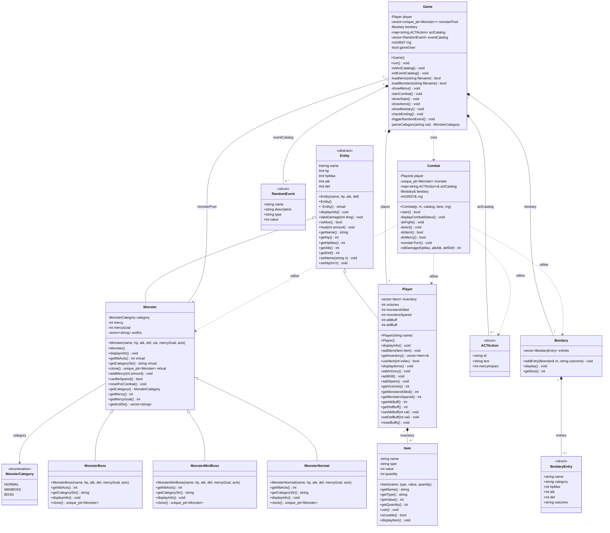

# ALTERDUNE — Mini-RPG en C++ (Console)

> Projet de Programmation Orientee Objet — ESILV — Second semestre 2025-2026

## Presentation

**ALTERDUNE** est un mini-jeu RPG en console developpe en **C++**, inspire des RPG au tour par tour. Le joueur affronte des monstres dans des combats strategiques, avec la possibilite de les **tuer** ou de les **epargner** grace au systeme de **Mercy**. Le jeu propose **3 fins multiples** determinees par les choix du joueur.

## Auteurs

| Nom           | Role        |
|---------------|-------------|
| [Nom 1]       | Developpeur |
| [Nom 2]       | Developpeur |

## Prerequis

- Compilateur C++ compatible **C++17** (g++, clang++, ou MSVC)
- Terminal supportant les codes ANSI (Windows Terminal, Linux, macOS)

## Compilation et execution

```bash
make            # compile le projet
make clean      # supprime les fichiers objets et l'executable
./alterdune     # lance le jeu
```

Les fichiers `items.csv` et `monsters.csv` doivent etre dans le meme repertoire que l'executable.

## Mecaniques de jeu

### Combat au tour par tour
- **FIGHT** — Attaquer le monstre (degats = random + ATK - DEF)
- **ACT** — Choisir une action pour modifier la jauge Mercy (2/3/4 actions selon la categorie)
- **ITEM** — Utiliser un item de l'inventaire (soin, buff ATK, buff DEF)
- **MERCY** — Epargner le monstre si la jauge Mercy est pleine

### Categories de monstres (polymorphisme)
| Categorie  | Nb actions ACT |
|------------|:--------------:|
| NORMAL     |       2        |
| MINIBOSS   |       3        |
| BOSS       |       4        |

### Fins multiples (a 10 victoires)
- **Fin Genocidaire** — Tous les monstres tues
- **Fin Pacifiste** — Tous les monstres epargnes
- **Fin Neutre** — Melange de tues et d'epargnes

## Bonus implementes

- **Couleurs ANSI** — Interface coloree en console (HP, menus, fins, bestiaire)
- **Nouveaux types d'items** — ATK_BUFF et DEF_BUFF en plus de HEAL
- **Formule de degats amelioree** — ATK et DEF influencent les degats (base + ATK - DEF)
- **Evenements aleatoires** — 40% de chance d'un evenement entre les combats (soin, piege, buff, item)

## Arborescence des fichiers

```
ALTERDUNE/
├── README.md
├── Makefile
├── items.csv
├── monsters.csv
├── context.md
├── ESIL-PROJET-ALTERDUNE.md
├── UML/
│   └── diagramme.puml
├── include/
│   ├── ACTAction.h
│   ├── Bestiary.h
│   ├── Colors.h
│   ├── Combat.h
│   ├── Entity.h
│   ├── Game.h
│   ├── Item.h
│   ├── Monster.h
│   ├── MonsterNormal.h
│   ├── MonsterMiniBoss.h
│   ├── MonsterBoss.h
│   └── Player.h
└── src/
    ├── main.cpp
    ├── Entity.cpp
    ├── Player.cpp
    ├── Monster.cpp
    ├── MonsterNormal.cpp
    ├── MonsterMiniBoss.cpp
    ├── MonsterBoss.cpp
    ├── Item.cpp
    ├── Combat.cpp
    ├── Bestiary.cpp
    └── Game.cpp
```

## Diagramme UML detaille

Le diagramme UML complet est disponible en format PlantUML dans `UML/diagramme.puml`. Une version Mermaid est fournie ci-dessous (rendue automatiquement sur GitHub/GitLab).



### Description des classes

#### Hierarchie d'heritage

- **`Entity`** *(classe abstraite)* — Base commune a `Player` et `Monster`. Definit les attributs vitaux (`name`, `hp`, `hpMax`, `atk`, `def`) et la methode virtuelle pure `displayInfo()`.
- **`Player`** — Heritier d'`Entity`. Gere l'inventaire, les compteurs de victoires/kills/spares et les buffs temporaires (`atkBuff`, `defBuff`).
- **`Monster`** — Heritier d'`Entity`. Classe de base polymorphe pour les monstres : gere la jauge `mercy`, les actions ACT et la categorie. Methodes virtuelles `getNbActs()`, `getCategoryStr()`, `clone()` redefinies dans les sous-classes.
- **`MonsterNormal` / `MonsterMiniBoss` / `MonsterBoss`** — Sous-classes concretes qui specialisent le nombre d'actions ACT (2/3/4) et la chaine de categorie.

#### Classes de gameplay

- **`Item`** — Represente un objet de l'inventaire (`HEAL`, `ATK_BUFF`, `DEF_BUFF`) avec une quantite consommable.
- **`Combat`** — Orchestre le combat tour par tour entre `Player` et `Monster`. Possede les references vers le joueur, le catalogue d'ACT et le bestiaire ; detient un `unique_ptr<Monster>` pour le polymorphisme.
- **`Bestiary`** — Stocke les `BestiaryEntry` (nom, categorie, stats, issue "Tue"/"Epargne") pour les monstres rencontres.
- **`Game`** — Point d'entree principal. Charge les CSV, initialise les catalogues d'ACT et d'evenements, gere le menu, lance les combats et determine la fin.

#### Structures de donnees

- **`ACTAction`** — Structure pour une action ACT (`id`, `text`, `mercyImpact`).
- **`RandomEvent`** — Structure pour un evenement aleatoire entre combats (`HEAL`, `DAMAGE`, `ATK_BOOST`, `DEF_BOOST`, `ITEM_FIND`).
- **`BestiaryEntry`** — Entree du bestiaire (snapshot des stats d'un monstre vaincu).
- **`MonsterCategory`** *(enum)* — `NORMAL`, `MINIBOSS`, `BOSS`.

### Types de relations utilisees

| Symbole UML | Relation       | Exemple                                  |
|-------------|----------------|------------------------------------------|
| `<\|--`     | Heritage       | `Player` herite de `Entity`              |
| `*--`       | Composition    | `Player` contient ses `Item`             |
| `o--`       | Agregation     | `Game` possede un pool de `Monster`      |
| `..>`       | Dependance     | `Combat` utilise `Player` et `Monster`   |
| `-->`       | Association    | `Monster` reference `MonsterCategory`    |

### Generer le diagramme PlantUML en image

Le fichier source `UML/diagramme.puml` peut etre rendu via :

```bash
# en local (necessite plantuml)
plantuml UML/diagramme.puml          # genere UML/diagramme_uml.png
```

Ou en ligne sur [PlantUML Online Server](https://www.plantuml.com/plantuml/uml).

---

**ESILV — Programmation Orientee Objet en C++ — 2025-2026**
